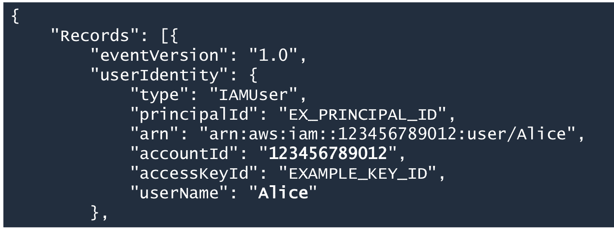
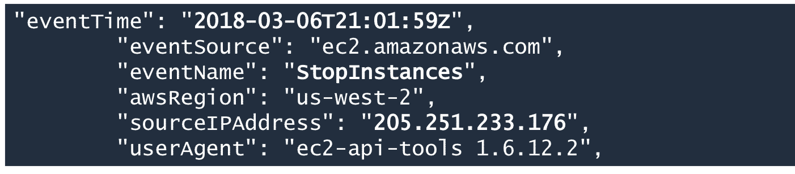
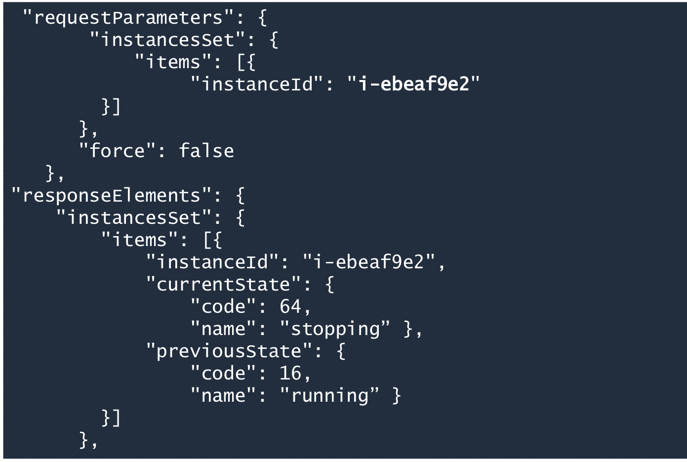
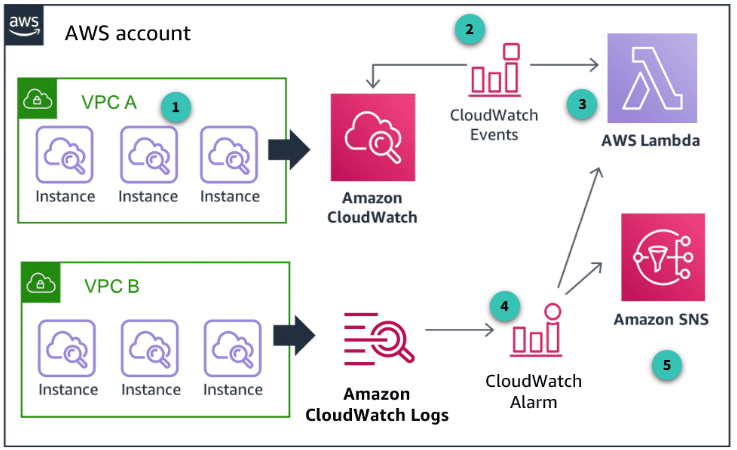

# AWS Security Fundamentals (Second Edition)

### Course Introduction

We will learn how to leverage
- AWS Config
- AWS CloudTrail
  
to track our AWS resources and review event history

#### 7 Design Principles for Security
1) Have a strong identity foundation
   - Have minimal privileges
2) Enable traceability
   - Ability to monotor, alert, and audit actions in our environment
3) Security at all layers, not just one outer layer
4) Ability to **automate** security into your application
5) Protecting data in transit and at rest
   - During network requests and in database?
6) Principle of least privilege
   - Similiar to Rule 1, Have least privilege
   - Deny everything, and then grant access as needed
7) Prepare for secuirty events
   - Have an incident management process

### AWS Global Infrastructure

Multiple Physical Data Centers are grouped together into logical units called **Availability Zones**

Multiple Availability Zones are grouped together in a **Region**

We must select which AWS Region to host our resource. Factors to choosing a region includes
- End User's location
- Cost
- Compliances to laws

Not every Region offers all AWS Services so we need to consider the services we need (now and in the future)

## AWS Actions to secure the cloud

### Data Center Security
- AWS Data centers have physical security in place
- AWS considers environmental risks when choosing data center locations
- Ensure climate control and power is reliable at the data centers
  
### Compliance and Governance
- AWS obtains certifications and independent third-party attestations
- Ensures their cloud infrastructure is secure

**NOTE:** It is our responsibility to secure our application and architectures

### AWS Artifacts
- AWS's security and compliance reports for customers to check

# Security INSIDE the cloud

How to create applications and design architectures in the cloud that are **secure**

### API Calls
- Communication to AWS Services is eessentially making API requests to their API endpoints
- AWS Services will **authenticate** every request (identify who you are) and check if the request has the **authorization** for that requested action using IAM
  - When the service endpoint receives a request, it will call IAM internally to validate the credentials
  - You can make requests using credentials from
    - user access keys through IAM Users (if server isn't deployed as an AWS Instance)
    - IAM Roles which are assigned to instances on AWS (Must be deployed in an AWS environement that supports using IAM Roles)

## AWS Identity and Access Management

This is the centralized mechanism for creating and managing individual users and their permisions with our AWS account (we are the root user)

Types of AWS Credentials
- Username and Password
  - We can set a password policy to ensure secure passwords by users
- Multi-Factor Authentication
  - An additional step to be authenticated besides just username and password
- User Access Keys
  - Secret keys an IAM user can use to make API calls programmatically via AWS SDKs, AWS CLI, or even direct HTTPS (not common and can be a hassle because you need to use SigV4 to sign the request)
- Amazon EC2 Key Pair
  - Generate secret credentials that is used to ssh or remote desktop into an EC2 instance.
  - Anyone can ssh into an EC2 instance if they can get access to the private key file

### Amazon Cognito

A service for end users to sign up, sign in, and authenticates users and manage what they are authorized to do. We essentially don't need to build our own login system.

This is so that we don't need to manage a group of IAM Users, IAM Users are typically developer and those on the team. Amazon Cognito is used for clients that use our application.

### AWS Secrets Manager

An AWS Service that stores all of your secrets such as passwords, api keys, basically any arbitrary texts

This is if we want to make API calls for secrets instead of storing secrets on a server for example.

AWS Secrets Manager can also rotate keys, eliminating manual key rotations if stored on each server that we deploy.

### AWS Security Token Services (STS)

An Amazon service that grants IAM Users with temporary credentials when in need of diferent permissions

For those who are performing another role temporarily, and is not permanent. We don't want to give them permanent permissions.

### AWS IAM Identity Center
A way to merge multiple AWS accoutns and business applications into 1 account. This is a Single Sign-On Service.

### AWS Directory Service
Run a Microsoft active directory of users in AWS. This is like logging into a windows computer (Microsoft owns Windows).

### AWS Organization
Centrally manage and enforce policies for multiple AWS accounts

# Detective Controls

## AWS CloudTrail

- Records API Calls made on our account to track changes made to our AWS resources

This service is enabled by default on our AWS Account

### CloudTrail Log File Examples

#### Verify the user's identify

#### When and from where?
- userAgent field describes what was used to send the request

#### What happened?

### A proper Amazon Cloud*Watch* Architecture (different from Cloud*Trail*)

1) CloudWatch **Agents** are installed to allow communication between say an EC2 instance and CloudWatch
2) CloudWatch **Events** processes events
3) AWS Lambda is a "serverless" function where we only pay for it's compute time.
4) CloudWatch alarms can trigger AWS Services like AWS Lambda and Amazon SNS depending on a certain event
5) Amazon SNS stands for Simple Notification Service and can notify by email, mobile device, lambda functions, Amazon Simple Queue Service, etc.

## Auditing on AWS

- Amazon S3 Access Logs
  - Access logs contain details about requests like request type, date, time, etc
- ELB (Elastic Load Balancing) Access Logs
  - Captures detailed info about each request sent to our load balancer
- Amazon CloudWatch Logs and Events
  - Monitor and troubleshoot operating systems and applications running in our AWS environemtn
  - Can look out for specific phrase, patterns and values
- Amazon VPC Flow Logs
  - Observe network traffic and see if you configured the virtual private cloud correctly
  - VPC is essentially an isolated private network in our AWS environment
- AWS CloudTrail logs
  - The logs that records API calls made to our account through AWS CLI, AWS SDKs, or other AWS services

## Additional AWS Services for Detective control
- Amazon GuardDuty
  - An Amazon service for threat detection by leveraging Machine Learning
- AWS Trusted Advisor
  - Inspects our AWS environments to make sure our system is efficient in performance and cost. Also it can find security gaps
- Amazon VPC Flow Logs
  - Captures information about the IP traffic going to and from network interfaces in our VPC
  - Literally ONLY network traffic metadata like src IP, dst IP, ports, protocols (TCP or UDP), etc
- AWS Security Hub
  - A dashboard that allows us to oversee secuirty alerts and compliance status across AWS Accounts

## AWS Config

A continous monitoring and assessment service to help detect non-compliance configurations in real time

It monitors AWS Resroouces like EC2 instances.

AWS provides pre-built rules, but we can make our own rules too.

An example would be ensuring encryption is turnd on for all EBS (Elastick Block Store) volumes in our account
- For context, EBS is essential a virtual hard drive in the cloud that you attach to an EC2 instance

