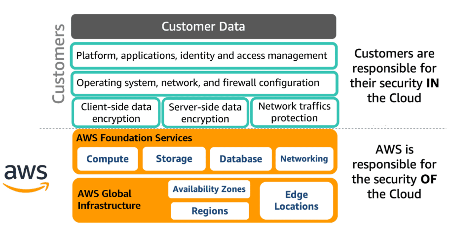

# AWS Security Fundamentals (Second Edition)

### Course Introduction

We will learn how to leverage
- AWS Config
- AWS CloudTrail
  
to track our AWS resources and review event history

#### 7 Design Principles for Security
1) Have a strong identity foundation
   - Have minimal privileges
2) Enable traceability
   - Ability to monotor, alert, and audit actions in our environment
3) Security at all layers, not just one outer layer
4) Ability to **automate** security into your application
5) Protecting data in transit and at rest
   - During network requests and in database?
6) Principle of least privilege
   - Similiar to Rule 1, Have least privilege
   - Deny everything, and then grant access as needed
7) Prepare for secuirty events
   - Have an incident management process

### AWS Global Infrastructure

